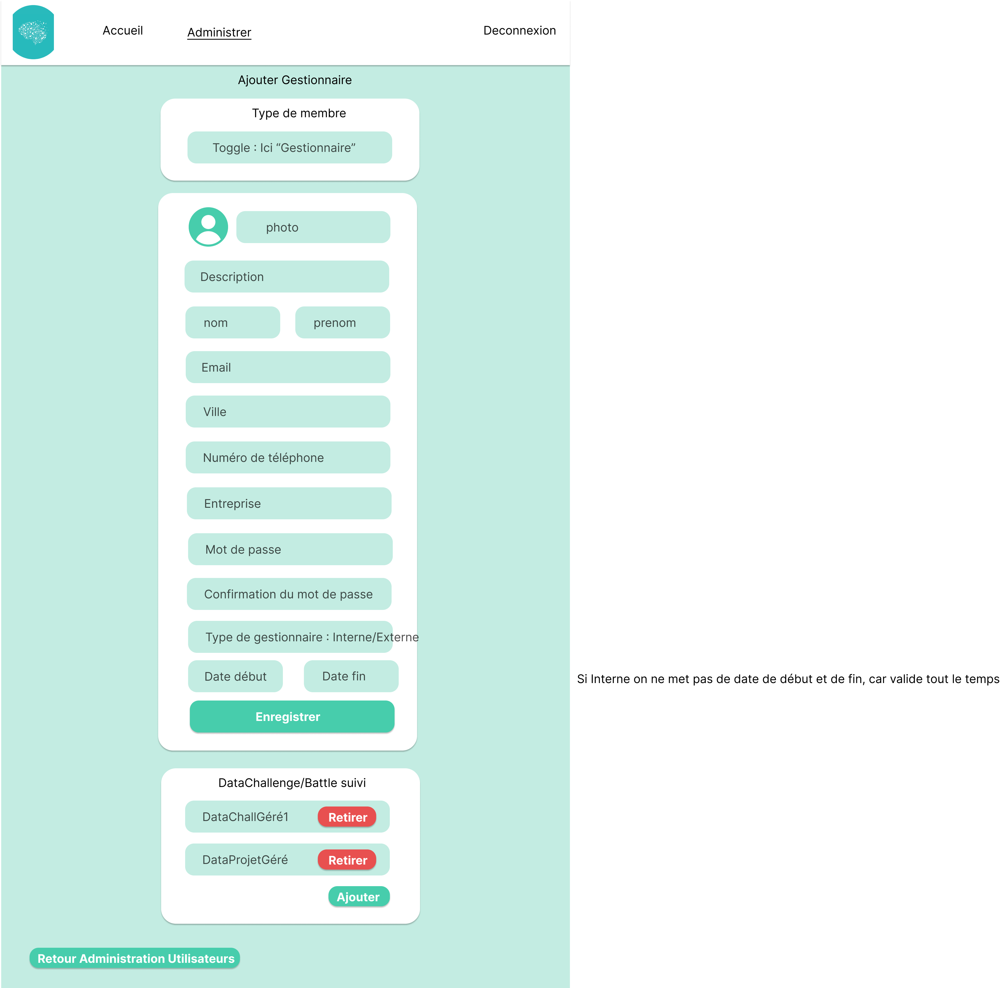

# Introduction

## Présentation du projet ING1 GI

Au cours de notre première année à l'école d'ingénieurs CY-Tech Pau, nous avons eu l'opportunité de mettre en pratique nos connaissances et compétences acquises en informatique en réalisant un projet de fin d'année. Notre projet consistait à développer un site internet complet et dynamique pour l'association IAPau.

## Contexte et objectifs du projet

Ce projet a été conçu dans le but de nous permettre d'appliquer concrètement les compétences que nous avons acquises tout au long de notre première année. En travaillant en équipe, nous avons eu l'occasion de collaborer avec des camarades de promotion, formant ainsi des équipes aléatoires, afin de développer nos compétences en travail d'équipe et de renforcer notre capacité à travailler avec autrui.
L'objectif principal était de concevoir un site permettant aux utilisateurs de s'inscrire et de participer aux Data Challenges et Data Battles proposés par l'association IA Pau, ainsi que de permettre aux Gestionnaires de gérer ces Data Challenges/Battles et aux Administrateurs de gérer en plus des Data Challenges/Battles les utilisateurs et ressources du site. 

# Analyse des besoins

## Présentation du contexte de l'association IA PAU

L’association IA PAU est une association à but non lucratif qui rassemble chercheurs, enseignants, étudiants, entrepreneurs, particuliers autour de la thématique du traitement des données et propose de rapprocher la sphère économique, le monde académique et le grand public en organisant des événements et des projets collaboratifs.
Son objectif est de vulgariser et partager les connaissances autour de ce progrès majeur du XXIème siècle qui suscite de nombreuses interrogations scientifiques, technologiques, éthiques, et démocratiques.
L’intelligence artificielle, de plus en plus présente dans notre quotidien et dans les médias, suscite de nombreuses interrogations. Alors qu’elle est parfois présentée comme une simple évolution de l’informatique, seulement capable de reproduire des comportements observés dans une grande quantité de données, les progrès réalisés ces cinq dernières années par l’IA questionnent sur les ingrédients et les limites des technologies de l’intelligence artificielle.
L’ association IA PAU a pour ambition de démystifier l’intelligence artificielle en la rendant accessible au plus grand nombre en proposant des événements d’acculturation, d’information et de partage. Elle favorise et accompagne également des projets collaboratifs entre entreprises, associations, collectivités et étudiants pour faciliter les échanges dans le domaine de l’Intelligence Artificielle et pour instaurer une dynamique collective pérenne dans le territoire.

## Description du déroulement d'un data challenge

Un Data Challenge est une compétition sur un weekend dans laquelle plusieurs équipes s'affrontent pour résoudre un problème spécifique en utilisant des techniques de traitement et d'analyse des données. Les équipes sont évaluées en fonction de la qualité de leurs résultats et de leur approche méthodologique.
Un Data Battle est une variante du Data Challenge qui se déroule sur une période d'un mois, il se compose d'un projet unique et les équipes participantes doivent répondre à des questionnaires hebdomadaires. Un podium est affiché sur la page d'accueil du site, mis à jour chaque semaine en fonction des résultats des questionnaires.

## Identification des besoins et enjeux de l'application

L'objectif de l'application que nous devons développer est de fournir une plateforme en ligne permettant aux utilisateurs de s'inscrire et de participer aux Datas Challenges et aux Dats Battles organisés par l'association IA Pau. Les principaux besoins et enjeux identifiés sont :

- VISITEUR : Accès aux informations des Data Challenges et Battles.

- VISITEUR (Uniquement pour Data Battle) : Le podium doit être affiché sur la page d'accueil du site, montrant le classement des équipes en fonction de leurs performances dans les questionnaires. Il doit être actualisé toutes les semaines après la date de rendu des questionnaires hebdomadaires.

- VISITEUR : Les visiteurs doivent pouvoir s'inscrire sur le site en fournissant leurs informations personnelles.

- ÉTUDIANT : Les étudiants doivent avoir la possibilité de former des équipes ou de rejoindre des équipes existantes pour participer aux compétitions.

- ÉTUDIANT : Les équipes participantes à un Data Challenge ou un Data Battle doivent pouvoir soumettre leurs résultats pour évaluation.

- ÉTUDIANT : Les étudians doivent pouvoir communiquer avec les gestionnaires des evenements par messages.

- ÉTUDIANT (Uniquement pour Data Battle) : Les équipes doivent pouvoir répondre aux questionnaires hebdomadaires pour accumuler des points et améliorer leur classement.

- GESTIONNAIRE : Les gestionnaires doivent accéder à tous les Data Challenges et Battle qu'ils gèrent.

- GESTIONNAIRE : Les gestionnaires doivent pouvoir échanger des messages avec tous les Étudiants d'un Data Challenge/Battle,  d'un Projet et d'une équipe.

- GESTIONNAIRE : Les gestionnaires doivent pouvoir créer des questionnaires, consulter les réponses des équipes et les noter.

- ADMINISTRATEUR : Les Administrateurs du site doivent pouvoir créer, éditer et supprimer des Administrateurs, Gestionnaires et Étudiants, des Data Challenges, Battle, des Projets et des ressources.

Nous détaillerons plus bas les besoins et enjeux, ainsi que les fonctionnalités spécifiques à mettre en place pour répondre à ces exigences.

# Spécifications fonctionnelles

## Présentation des différents profils utilisateurs

Le site accueille quatre types d'utilisateurs, des Administrateurs, des Gestionnaires (interne ou externe), des Étudiants et des Visiteurs.

## Description des fonctionnalités d'administration

L'Administrateur peut accéder à un panneau principal où il peut administrer les Utilisateurs, les Data Challenges ainsi que les ressources.

### Administration des utilisateurs

L'administrateur pour modifier les données de tous les utilisateurs. Il peut également créer d'autres comptes Administrateurs, créer des comptes Étudiants et des comptes Gestionnaires.
Il peut également gérer les équipes des utilisateurs.

### Administration des Data Challenges/Battles

L'administrateur peur créer, modifier ou supprimer des Data Challenges/Battles. Créer des projets à l'intérieur des Data Challenges/Battles (un unique projet pour les Data Battles). Assigner des Gestionnaires aux Datas Challenges/Battles. Ajouter des ressources aux Datas Challenges/Battles ainsi qu'à tous les projets.

### Administration des Ressources

L'administrateur peut créer, modifier ou supprimer des ressources.

## Description des fonctionnalités pour les gestionnaires

Il existe deux types de gestionnaire, le gestionnaire interne (fait partie de IA Pau, pas de date de fin d'activation) et le gestionnaire externe (gestionnaire temporaire le temps d'un Data Challenge/Battle venant d'une entreprise extérieure).

Seul un Administrateur peut créer un compte Gestionnaire et l'assigner à des Datas Challenges/Battles.

Le gestionnaire peut éditer son profil et ainsi redéfinir son mot de passe, il peut accéder aux Datas Challenges/Battles qu'il gère.

S'il clic sur un Data Challenge/Battle, il peut envoyer des messages à tous ses membres, s'il clic sur un projet d'un Data Challenge, il peut envoyer des messages à tous les membres du projet et s'il clic sur une équipe il peut envoyer un message à tous les membres d'une équipe. Il peut également accéder aux dossiers des équipes afin de voir leur lien GitHub et de les noter à la fin de l'évènement.

S'il clic sur un DataBattle il peut envoyer des messages à tous les membres du DataBattle. Il peut également créer des questions pour le questionnaire du DataBattle, ainsi que noter les réponses des équipes.

## Description des fonctionnalités principales pour les étudiants connectés

Un étudiant connecté peut consulter la même page d'accueil qu'un étudiant non connecté et ainsi voir les Data Challenges/Battles, leurs informations et y participer.

Si un étudiant connecté choisi de participer à un événement, cela crée une équipe et le met capitaine. Il peut ensuite choisir un nom d'équipe, le projet auquel il souhaite participer (seulement pour les Data Challenges, car il n'y a qu'un projet unique pour les Data Battle) et inviter d'autres Étudiants à rejoindre son équipe.

Les membres de l'équipe qui ne sont pas capitaine peuvent uniquement accéder aux informations de l'équipe (projet choisi par le capitaine, nom équipe et nom des membres).

Une fois qu'un étudiant connecté participe à un Data Challenge il accède à toutes les informations du DataChallenge, peut consulter les ressources, échanger des messages avec les gestionnaires de l'évènement. De plus, s'il est capitaine, il peut ajouter le lien GitHub du projet.

Une fois qu'un étudiant connecté participe à un Data Battle en plus de tout ce qui est écrit ci-dessus, l'utilisateur peut voir les questionnaires et s'il est capitaine, il peut y répondre.

## Description des fonctionnalités des utilisateurs non connectés

Les visiteurs voient la page d'accueil avec tous les Data Challenges/Battles, peuvent consulter les informations et choisir d'y participer. S'ils cliquent sur participer ils sont invités à se connecter ou à créer un compte.

# Conception et architecture

## Présentation de l'architecture globale de l'application

L'architecture globale de l'application se compose d'un front-end développé avec React, un back-end utilisant des API en PHP et Java, un serveur MySQL pour gérer la base de données, le tout étant conteneurisé à l'aide de Docker. Cette architecture permet une conception modulaire et flexible de l'application, facilitant son développement, sa gestion des données et son déploiement sur différents environnements.

## Description des choix technologiques et des outils utilisés

Front : React est une bibliothèque JavaScript populaire pour la création d'interfaces utilisateur interactives et réactives. Il offre une approche déclarative et modulaire du développement d'applications web, ce qui facilite la création et la gestion de composants réutilisables. React permet également une mise à jour efficace et optimisée de l'interface utilisateur, grâce à son algorithme de rendu virtuel. Son écosystème riche et sa grande communauté de développeurs en font un choix solide pour le développement de l'interface utilisateur d'une application web.

Back : L'utilisation d'API PHP et Java offre une flexibilité dans le choix des technologies de développement du backend. PHP est un langage de script côté serveur largement utilisé, connu pour sa facilité d'apprentissage et sa compatibilité avec de nombreux systèmes d'exploitation et serveurs web. Java, quant à lui, est un langage de programmation polyvalent et robuste, souvent utilisé pour le développement d'applications d'entreprise et de services web. Ces deux langages offrent une grande variété de bibliothèques et de frameworks pour faciliter le développement, la gestion des données et la communication avec d'autres services.

Serveur MySQL : MySQL est un système de gestion de base de données relationnelle largement utilisé. Il offre une grande fiabilité, des performances élevées et une compatibilité avec de nombreux langages de programmation. En utilisant MySQL, l'application peut stocker et gérer les données de manière efficace et sécurisée.

Docker : Docker est une technologie de conteneurisation qui permet de créer et de gérer des conteneurs légers et portables pour les applications. En utilisant Docker, il devient plus facile de déployer et de gérer l'application sur différents environnements, en assurant la portabilité et la cohérence du système. Les conteneurs Docker permettent également d'isoler les différentes parties de l'application, facilitant ainsi la gestion des dépendances et la scalabilité horizontale. Docker simplifie le déploiement de l'application et réduit les problèmes potentiels liés à la configuration de l'environnement de production.

En résumé, l'utilisation de React pour le frontend, des API PHP et Java pour le backend, et Docker pour la conteneurisation, offre une combinaison solide de technologies qui permet une conception modulaire, une flexibilité de développement et un déploiement simplifié de l'application. Ces choix sont basés sur la popularité, la facilité d'utilisation, la robustesse et la compatibilité des technologies, ainsi que sur la disponibilité d'une vaste communauté de développeurs et de ressources pour les soutenir.

## Présentation des diagrammes et de la maquette

Avant de commencer la conception du modèle conceptuel de données (MCD) et de la base de données (BDD), nous avons réalisé plusieurs diagrammes spécifiques afin de mieux appréhender le projet et visualiser les fonctionnalités ainsi que les pages que nous devrons développer. Ces diagrammes nous ont permis de nous approprier le projet et d'avoir une vision claire de sa structure et de son fonctionnement. Ils constituent une étape préliminaire importante dans le processus de conception de l'application.

### Diagramme use case

Dans un premier temps, nous avons créé un diagramme de cas d'utilisation qui illustre toutes les interactions de nos utilisateurs avec le système.

{height=100%}

### Diagramme pages

Ensuite, nous avons élaboré des diagrammes pour visualiser les pages que nous devrons développer et leurs interactions.

{height=100%}

{height=100%}

### Maquette

Grâce à ces diagrammes, nous avons réalisé une maquette pour nous assurer de développer un site cohérent et pour faciliter la répartition des tâches entre les membres de l'équipe.

#### Utilisateur non connecté

{height=100%}

{height=100%}

{height=100%}

{height=100%}

#### Utilisateur connecté

{height=100%}

{height=100%}

.png){height=100%}

{height=100%}

{height=100%}

#### Gestionnaire

{height=100%}

{height=100%}

{height=100%}

{height=100%}

#### Administrateur

{height=100%}

{height=100%}

{height=100%}

{height=100%}

{height=100%}

{height=100%}

{height=100%}

{height=100%}

{height=100%}

### Postman

Nous avons adopté une approche de développement où nous avons séparé le backend (API PHP) du frontend de notre application. Pour documenter et tester les différentes requêtes de notre API, nous avons utilisé Postman.

Postman est un outil très pratique qui nous permet de documenter et d'explorer les fonctionnalités de notre API. Nous pouvons créer des collections de requêtes, définir les paramètres et les en-têtes nécessaires, et tester chaque requête pour nous assurer qu'elle fonctionne correctement.

En utilisant Postman, nous avons pu établir une documentation complète de notre API, y compris les différentes routes, les méthodes HTTP supportées, les paramètres requis et facultatifs, ainsi que les réponses attendues. Cela facilite la collaboration avec notre équipe de développement frontend, car ils peuvent consulter la documentation pour comprendre comment interagir avec l'API et utiliser les données retournées.

De plus, Postman nous a permis de tester chaque requête individuellement pour nous assurer que notre API répond correctement et renvoie les données attendues. Nous avons pu vérifier les résultats et traiter les erreurs éventuelles pour améliorer la robustesse et la fiabilité de notre application.

En résumé, l'utilisation de Postman pour documenter et tester notre API PHP nous a permis de faciliter la communication et la collaboration entre le backend et le frontend de notre application, en assurant une compréhension commune des fonctionnalités de l'API et en garantissant son bon fonctionnement.

{height=100%}

{height=100%}

{height=100%}

## Présentation des modèles de données 

Lors de la conception de notre application, nous avons réalisé une modélisation des données en utilisant un Modèle Conceptuel de Données (MCD) et en construisant une Base de Données (BDD) en conséquence. Cette étape est cruciale pour définir la structure des données et les relations entre les différentes entités de notre système.

Nous avons récemment mis à jour notre Modèle Conceptuel de Données (MCD) et notre Base de Données (BDD) pour prendre en compte les nouvelles fonctionnalités et les évolutions de notre application. Les choix de modélisation ont été faits en tenant compte de la nature des données à stocker, des relations entre les entités et des contraintes de notre système.

{height=100%}

Pour répondre aux besoins de notre application, nous avons fait les choix de modélisation suivants :

- Table "Evenement" : Nous avons créé une table "Evenement" pour stocker les informations relatives aux événements, tels que les Data Challenges et les Data Battles. Cette table contient des attributs tels que "TypeEvenement" (pour distinguer les différents types d'événements), "Libele" (le titre de l'événement), "Description" (une brève description de l'événement), "Recompenses" (les récompenses associées à l'événement) et les dates de début et de fin de l'événement.

- Tables "Projet" et "Questionnaire" : Nous avons créé une table "Projet" pour stocker les informations sur les projets associés à un événement. Chaque projet est lié à un événement spécifique. De plus, nous avons ajouté une table "Questionnaire" pour stocker les informations sur les questionnaires associés à chaque projet. Cette modélisation nous permet de lier plusieurs questionnaires à un projet spécifique.

- Tables "Equipe" et "User" : Nous avons créé une table "Equipe" pour stocker les informations sur les équipes participantes. Chaque équipe est liée à un projet spécifique. De plus, nous avons une table "User" pour stocker les informations sur les utilisateurs, tels que leur nom, prénom, adresse e-mail, etc. Les utilisateurs peuvent appartenir à une équipe spécifique, ce qui est modélisé par une relation "Appartenir" entre les tables "User" et "Equipe".

- Tables de relations et de liens : Nous avons créé des tables de relations pour modéliser les liens entre les entités. Par exemple, nous avons une table "Preinscription" pour stocker les préinscriptions des utilisateurs à des équipes spécifiques, une table "NoteQuestionnaire" pour stocker les notes attribuées par une équipe à un questionnaire, et une table "ReponseQuestion" pour stocker les réponses des équipes aux questions du questionnaire.

- Contraintes d'intégrité référentielle : Nous avons utilisé des contraintes d'intégrité référentielle pour garantir la cohérence des données entre les tables. Par exemple, nous avons défini des clés étrangères pour relier les entités entre elles et assurer la suppression en cascade des enregistrements liés lorsque des entités parentes sont supprimées.

Ces choix de modélisation nous permettent de stocker et de gérer efficacement les données de notre application, en assurant la cohérence et l'intégrité des informations.

# Développement et implémentation

## Présentation des différentes étapes de développement

Notre projet de développement s'est déroulé en plusieurs étapes bien définies. Tout d'abord, nous avons commencé par un brainstorming pour s'impreigner des idées et des concepts. Ensuite, nous avons élaboré un diagramme use case et des diagrammes de pages afin de décrire les interactions et les fonctionnalités de notre système. Une fois cette étape terminée, nous avons créé une maquette qui représente visuellement l'interface utilisateur de notre application. Dans le même temps, Arthur et Maxime ont travaillé sur la réalisation de la base de données (BDD), tandis que Patrice s'occupait du développement de la maquette. Parallèlement, Quentin et Valentin ont créé les composants React en suivant la maquette. Une fois la BDD terminée, Maxime a rejoint l'équipe Front-end pour collaborer avec Quentin et Valentin. Arthur, de son côté, a commencé à créer l'API PHP pour le Backend. Une fois la maquette finalisée, Patrice a rejoint l'équipe Back-end. Après avoir achevé le développement du Backend, Arthur a pris en charge la création de l'API Java, tandis que Patrice s'est concentré sur la rédaction du rapport final du projet. Cette approche collaborative a permis une symbiose entre les équipes Back-end et Front-end, assurant ainsi une progression efficace et un développement cohérent de notre application.

## Présentation du développement des composants React (!!!!!!!!! EQUIPE FRONT A MODIFIER !!!!!!!!!)

Pour le front-end nous avons adopté une approche basée sur la maquette pour le développement des composants React. En se référant à la conception visuelle de l'interface utilisateur, nous avons créé des composants réutilisables.

Nous avons veillé à factoriser notre code, ce qui signifie que nous avons extrait des parties communes de notre logique pour les réutiliser facilement. Par exemple, nous avons créé des composants de bouton génériques avec des propriétés configurables, ce qui nous a permis de modifier rapidement et uniformément tous les boutons du site. Cela a simplifié la maintenance du code et nous a fait gagner du temps lors de l'ajout ou de la modification des fonctionnalités.

L'un des avantages clés de React réside dans sa nature déclarative, qui permet de construire des interfaces utilisateur interactives et réactives. Nous avons exploité cette capacité en utilisant les fonctionnalités telles que les états (states) et les propriétés (props) pour gérer le comportement dynamique de nos composants. Cela nous a permis de créer une expérience utilisateur fluide et interactive.

De plus, la modularité de React nous a facilité l'assemblage des composants. Nous avons pu organiser notre code en petits morceaux indépendants, ce qui a rendu la collaboration entre les membres de l'équipe plus efficace. Chaque développeur a pu travailler sur des parties spécifiques de l'interface sans interférer avec les autres, et ensuite, nous avons simplement assemblé les composants pour former l'application complète.

Cette approche basée sur React nous a offert une grande flexibilité et une facilité de maintenance. Nous avons pu apporter des modifications rapides et cohérentes à l'interface utilisateur, en gardant un code propre et bien structuré. En fin de compte, cela nous a permis de créer une application Web robuste et réactive, tout en facilitant les éventuelles évolutions et améliorations à l'avenir.

## Présentation de l'API PHP

Nous avons développé une API PHP pour permettre aux développeurs Front-end utilisant React d'accéder et de modifier la base de données (serveur MySQL). Tout d'abord, nous avons engagé des discussions approfondies avec les développeurs Front-end pour comprendre leurs besoins en termes de requêtes. Après avoir identifié ces besoins, nous avons établi une liste de priorités pour le développement des différentes requêtes.

En nous basant sur cette liste, nous avons commencé à implémenter les requêtes en fonction de leur ordre de priorité. Nous avons également maintenu une disponibilité constante pour créer de nouvelles requêtes en réponse aux besoins émergents des développeurs Front-end et pour apporter des correctifs aux requêtes existantes en cas d'erreurs ou de problèmes.

Pour faciliter les tests et la documentation de nos requêtes, nous avons utilisé Postman. Cela nous a permis de tester efficacement chaque requête et de fournir une documentation claire aux développeurs Front-end, afin qu'ils puissent facilement comprendre comment utiliser l'API.

Il convient de noter que la partie de l'API développée par Arthur est codée de manière procédurale, tandis que la partie réalisée par Patrice est codée selon une approche orientée objet. Nous avons fait ce choix en nous basant sur nos préférences et nos habitudes de développement, tout en nous assurant de lire et renvoyer les données au format JSON structuré de la même manière afin que cela soit transparant pour les développeurs Front-end.

En plus de fournir les fonctionnalités nécessaires, nous avons accordé une attention particulière à la sécurité de notre API. Pour garantir la confidentialité des informations sensibles et éviter les vulnérabilités potentielles, nous avons mis en place des mesures de sécurisation telles que l'authentification et l'autorisation.

Pour gérer l'authentification, nous avons utilisé JSON Web Tokens (JWT). Lorsqu'un utilisateur se connecte, notre API génère un token de connexion contenant des informations d'identification cryptées suivantes : le moment de génération du jwt, le nom du serveur, la date d’expiration du code (définie comme étant la date de création plus 60 minutes) et l’id de l’utilisateur. Ces données sont encodées grâce à une clef secrète, cette dernière permet d’encoder et de décoder les jwt envoyés et/ou reçus. Ce token est ensuite renvoyé à l'utilisateur et doit être inclus dans chaque requête subséquente en tant qu'en-tête d'autorisation.

{height=100%}

Lorsque notre API reçoit une requête avec un token d'autorisation, elle vérifie la validité du token et extrait les informations d'identification correspondantes. Cela nous permet d'identifier l'utilisateur et de déterminer s'il est autorisé à accéder aux ressources demandées ou à effectuer des modifications dans la base de données.

Nous avons également mis en place des mécanismes d'autorisation pour définir les droits d'accès des utilisateurs. En fonction de leur type d'utilisateur (administrateur, gestionnaire, etudiant, visiteur), nous avons défini des permissions spécifiques qui déterminent les actions qu'ils peuvent effectuer sur les données.

En fournissant cette couche de sécurité supplémentaire, nous nous sommes assurés que seuls les utilisateurs authentifiés et autorisés peuvent accéder aux données sensibles et effectuer des modifications dans notre système. Cela protège non seulement les informations confidentielles, mais garantit également l'intégrité de notre base de données.

Dans l'ensemble, notre API PHP a été développée en tenant compte des besoins des développeurs Front-end, avec une approche souple pour créer de nouvelles requêtes et apporter des améliorations. Nous avons veillé à maintenir une compatibilité transparente avec les développeurs Front-end en fournissant une documentation claire et en utilisant des formats de données standardisés. De plus, nous avons mis en place des mesures de sécurité solides, telles que l'authentification basée sur JWT, pour protéger les données sensibles et assurer la confidentialité des informations. Cette approche globale de sécurité a joué un rôle essentiel dans le succès de notre projet de développement.

## Présentation de l'API Java

Nous avons développé une API Java afin d'analyser un code source python envoyé par un utilisateur. Le code à analyser est envoyé dans le « body » de la requête. Il est ensuite analysé en le lisant ligne par ligne le body qui est du type « InputStream ». En fonction de l’url utilisé (« /getdata » ou « /search »), une méthode différente est utilisée.

Avant d’expliquer plus précisément le traitement des requêtes, tachons d’expliciter une classe créée pour le projet : « Fonction ». Celle-ci contient sous forme d’ArrayList<String> les différentes lignes d’une fonction python (du def jusqu’a la fin). Des méthodes sont implémentées dans la classe pour ajouter une ligne, récupérer le nombre de lignes, afficher la fonction, récupérer le contenu de la fonction (def non compris et sans les 4 espaces utilisés pour remplacer la tabulation), récupérer le nom de la fonction et ses arguments et une méthode pour afficher la fonction sous forme de JSON.

Pour le traitement de l’url « /getdata », les lignes sont d’abord lues une par une actualisant un compteur de ligne (dans la classe « httpHandler »), dans le cas d’une fonction, lors d’un « def », une nouvelle instance de la classe fonction est créée afin de stocker les lignes de la fonction jusqu’à ce que l’on en sorte, une fois que l’on quitte une fonction, l’objet fonction créé est ajouté à une pile de Fonction. Une fois le traitement du code complété, il est temps de traiter l’intérieur des fonctions afin de voir s’il n’y a pas de nouvelles fonctions dedans, pour ce faire, on réutilise le même principe qu’au-dessus, mais en dépilant la pile et récupérant les lignes de la pile. Dans le cas où l’on redécouvre une fonction, à la fin de celle-ci, elle est ajoutée à la pile de Fonctions et ainsi de suite jusqu’à ce qu’il n’y ait plus de fonctions dans la pile. Une fois toutes les fonctions traitées, les fonctions sont ajoutées à une ArrayList<Fonction> . Enfin, il suffit maintenant de générer les accesseurs afin de récupérer les données et d’ajouter toutes les données dans un JSON que l’on retourne à l’utilisateur.

Pour le traitement de « /search », on commence par récupérer le pattern que l’on retrouve dans l’url. Une fois cela fait, on lit les lignes de l’« InputStream » (body) une par une. Pour détecter les occurrences du mot saisit, on utilise les classes Pattern et Matcher (du package java.util.regex) pour avoir une liste d’itérateur d’occurrence de notre mot dans les lignes, il nous suffit donc de compter le nombre d’itération afin d’avoir le nombre d’occurrence du mot afin de générer un JSON.

Sur le site, tous les utilisateurs peuvent accéder à une page « Analyseur », dans celle-ci l’utilisateur peut insérer un fichier. Une fois inséré, le code est affiché dans la page web.

{height=100%}

L’utilisateur peut ensuite analyser le code, pour ce faire, on fait un appel au serveur java grâce à Ajax afin de récolter les données colectées. Tout d’abord les nombres de lignes différentes et leurs proportions dans le code.

{height=100%}

Ensuite les informations sur les fonctions créées : les lignes, les noms de fonctions les lignes par fonctions ainsi que des statistiques sur les fonctions (minimum de lignes, moyenne de lignes, max de lignes).

{height=100%}

{height=30%}

Enfin, les différentes lignes d’importation sont spécifiées afin de savoir les librairies importées et sous quel nom elles ont été importées.

{height=30%}

## Description des fonctionnalités implémentées (A FAIRE !!!!!!!!!!!!)

Descriptions fonctionnalités implémentés et mettre des images. 

# Perspectives et améliorations futures (FACULTATIF !!!!!!!!!!!!)

## Liste des fonctionnalités restantes à implémenter (FACULTATIF !!!!!!!!!!!!)

Ici on parle des fonctionnalités restantes à implémenter et au cahier des charges

## Propositions d'améliorations et d'évolutions pour l'application (FACULTATIF !!!!!!!!!!!!)

Ici on parle des fonctionnalités qu'on pourrait implémenter mais qui ne sont pas au cahier des charges

# Conclusion 

## Bilan du projet

Notre mission consistait à concevoir et à développer un site internet interactif et convivial, offrant une plateforme intuitive permettant aux utilisateurs de s'inscrire et de participer aux différentes compétitions liées à l'intelligence artificielle organisées par l'association IA Pau. Le site devait présenter un design moderne et attractif, tout en offrant une navigation fluide et une expérience utilisateur agréable.

L'une des principales fonctionnalités que nous avons développées était le système d'inscription aux Data Battles et aux Data Challenges. Les utilisateurs pouvaient créer un compte, se connecter et choisir parmi les différentes compétitions disponibles. Le site devait également permettre aux utilisateurs de consulter les informations détaillées sur chaque compétition, telles que les dates, les règles et les récompenses.

Nous avons également inclus des fonctionnalités de suivi des progrès et de classement pour les Data Battles, où les utilisateurs pouvaient suivre leur évolution tout au long des compétitions et comparer leurs résultats avec ceux des autres participants. Cela favorisait un esprit de compétition sain et stimulant, encourageant les utilisateurs à s'impliquer davantage et à améliorer leurs compétences en matière d'intelligence artificielle.

En outre, nous avons accordé une attention particulière à la convivialité du site, en veillant à ce qu'il soit accessible à tous les utilisateurs, quel que soit leur niveau de compétence en informatique. Nous avons optimisé l'interface utilisateur, en mettant l'accent sur la simplicité et la clarté, afin de garantir une expérience utilisateur fluide et agréable.

En résumé, ce projet de fin d'année a été une occasion unique de mettre en pratique nos compétences et connaissances en développement web tout en travaillant en équipe. Nous sommes fiers d'avoir contribué à la création d'un site internet complet et dynamique pour l'association IA Pau, offrant aux utilisateurs une plateforme interactive pour s'inscrire et participer aux compétitions liées à l'intelligence artificielle. Ce projet nous a permis d'acquérir une expérience précieuse et de nous préparer pour les défis à venir dans notre parcours d'ingénieur.

## Retour sur les apprentissages et les difficultés rencontrées

Au cours de notre projet, nous avons rencontré certaines difficultés liées à l'utilisation de GitHub. En tant qu'équipe, nous avons dû nous former par nous-mêmes pour apprendre à utiliser efficacement Git et GitHub. Une formation dédiée sur le versionnage des projets aurait été bénéfique, en particulier lors de notre première année d'ingénierie. Cela aurait permis de mieux comprendre les bonnes pratiques de collaboration, de gestion des branches, et de résolution des conflits.

La taille du projet a également posé un défi. Avec de nombreuses fonctionnalités et différentes parties à développer, il a fallu une bonne organisation et une communication constante pour maintenir la cohérence et la qualité du code. La gestion des dépendances, des versions et des mises à jour a également été un aspect important du projet qui nécessitait une attention particulière.

Malgré ces difficultés, nous avons considéré cette expérience comme une occasion d'apprentissage précieuse. Nous avons acquis une compréhension plus approfondie du développement d'applications web, de la conception de bases de données, de l'utilisation d'outils tels que Docker et Postman, ainsi que de la collaboration en équipe.

En conclusion, bien que nous ayons rencontré des défis lors de la mise en œuvre de notre projet, nous avons pu surmonter ces difficultés grâce à notre détermination, notre auto-formation et notre collaboration étroite en tant qu'équipe. Ces expériences d'apprentissage nous ont permis d'améliorer nos compétences techniques et de développer une approche plus réfléchie et méthodique du développement logiciel. Nous recommandons vivement une formation sur le versionnage des projets dès les premières étapes de l'apprentissage de l'ingénierie pour faciliter les futurs projets et favoriser une collaboration harmonieuse entre les développeurs.

## Remerciements (!!!!!!!!!!!! ON GARDE ???? !!!!!!!!!!)

Nous tenons à exprimer nos sincères remerciements pour l'intérêt que vous portez à notre rapport. Au cours de ce projet, nous avons consacré de nombreuses heures de travail, de réflexion et de collaboration pour atteindre les objectifs que nous nous étions fixés. Cela n'aurait pas été possible sans le soutien et la contribution de nombreuses personnes et nous aimerions profiter de cette occasion pour les remercier.

Tout d'abord, nous souhaitons exprimer notre gratitude envers notre équipe. Chacun d'entre nous a apporté des compétences uniques, une motivation et une détermination qui ont été essentielles à la réussite de ce projet. Nous avons su faire preuve de collaboration, d'entraide et de respect mutuel tout au long du processus de développement, ce qui a permis de créer une synergie et une dynamique de travail exceptionnelles.

Nous tenons également à remercier nos encadrants, qui nous ont prodigués de précieux conseils tout au long de ce projet. Leur disponibilité et leur bienveillance ont grandement contribué à notre apprentissage et à notre progression.

Nous souhaitons également exprimer notre reconnaissance envers les personnes qui ont accepté de tester notre application et de nous fournir leurs retours. Leurs commentaires constructifs et leurs suggestions ont été d'une valeur inestimable pour améliorer l'expérience utilisateur et la fonctionnalité de notre application. Leur implication et leur volonté de nous aider ont été une véritable source de motivation pour nous.

Enfin, nous tenons à remercier nos proches, nos familles et nos amis, qui nous ont soutenus tout au long de ce projet. Leur soutien moral, leurs encouragements et leur compréhension ont été essentiels pour nous permettre de nous consacrer pleinement à cette aventure.

En conclusion, nous tenons à exprimer notre profonde gratitude envers toutes les personnes qui ont contribué de près ou de loin à la réalisation de ce projet. Votre soutien, votre collaboration et votre confiance ont été les clés de notre réussite. Nous sommes fiers du travail accompli et nous vous remercions sincèrement pour votre précieuse contribution.